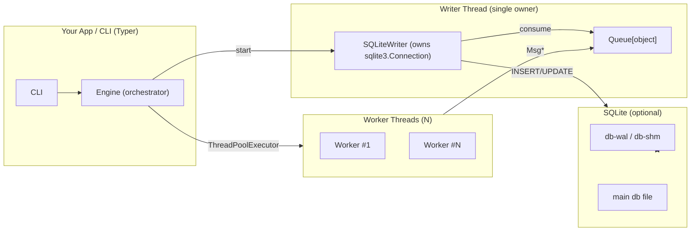

# Components & Flow

## High-level components

## Key ideas

- Single writer: no cross-thread SQLite usage.
- Typed messages: workers emit intent; writer persists.
- Two progress managers: sticky overall, transient per-task.
