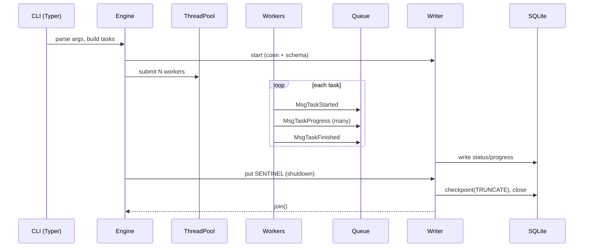
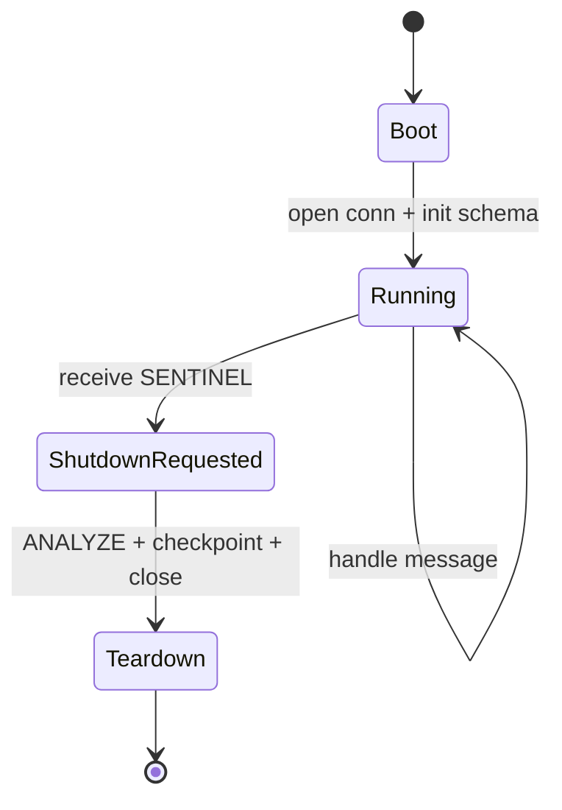

# Sequences & States

## Execution sequence

```mermaid
sequenceDiagram
  participant CLI as CLI (Typer)
  participant ENG as Engine
  participant T as ThreadPool
  participant W as Workers
  participant Q as Queue
  participant WR as Writer
  participant DB as SQLite

  CLI->>ENG: parse args, build tasks
  ENG->>WR: start (conn + schema)
  ENG->>T: submit N workers
  loop each task
    W->>Q: MsgTaskStarted
    W->>Q: MsgTaskProgress (many)
    W->>Q: MsgTaskFinished
  end
  WR->>DB: write status/progress
  ENG->>WR: put SENTINEL (shutdown)
  WR->>DB: checkpoint(TRUNCATE), close
  WR-->>ENG: join()
```

## Writer state

```mermaid
stateDiagram-v2
  [*] --> Boot
  Boot --> Running: open conn + init schema
  Running --> Running: handle message
  Running --> ShutdownRequested: receive SENTINEL
  ShutdownRequested --> Teardown: ANALYZE + checkpoint + close
  Teardown --> [*]
```
